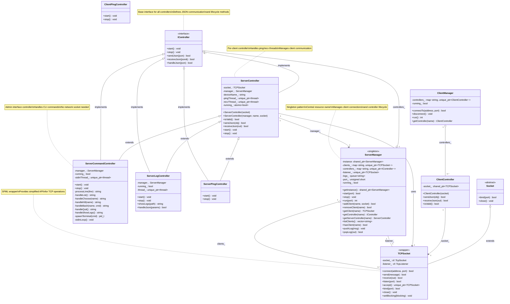

# PSO-RAT Class Diagram

## Overview
Această diagramă prezintă relațiile între clasele principale din proiectul PSO-RAT.



## Explicația Arhitecturii

### Componente Principale

1. **ServerManager** (Singleton)
   - Orchestratorul central al serverului
   - Gestionează două colecții importante:
     - `clients_`: socket-urile TCP ale clienților conectați
     - `controllers_`: obiectele care implementează logica pentru fiecare client/serviciu

2. **IController** (Interface)
   - Interfața de bază pentru toate controller-ele
   - Definește metodele standard: `start()`, `stop()`, `sendJson()`, `receiveJson()`, `handleJson()`

3. **ServerController** (Per-Client)
   - Gestionează comunicarea cu un client specific
   - Rulează thread-uri pentru ping și recepție mesaje
   - Implementează protocolul JSON cu clientul

4. **ServerCommandController** (Admin)
   - Gestionează comenzile administrative prin stdin
   - Nu folosește socket TCP (doar pentru comenzi locale)
   - Implementează comenzile: list, choose, kill, bash, showlogs, quit

5. **ServerLogController** (Logging)
   - Gestionează log-urile serverului
   - Poate spawna terminal-uri pentru vizualizarea log-urilor

### Fluxul de Date

1. **Conectarea Clientului:**
   ```
   Client → ServerManager.listener_ → ServerManager.run()
   → Creare TCPSocket în clients_[deviceName]
   → Creare ServerController în controllers_[deviceName]
   → ServerController.start()
   ```

2. **Comenzi Administrative:**
   ```
   stdin → ServerCommandController.stdinLoop()
   → processLine() → handle*() methods
   → Interacțiune cu ServerManager pentru list/kill/bash
   ```

3. **Comunicarea Client-Server:**
   ```
   Client JSON → TCPSocket → ServerController.receiveJson()
   → ServerManager.pushLog() → Logs queue
   ```

### Avantajele Acestei Arhitecturi

- **Separarea Responsabilităților:** Fiecare controller are un rol clar
- **Extensibilitate:** Adăugarea unui nou tip de controller este simplă
- **Gestionarea Resurselor:** ServerManager controlează durata de viață a socket-urilor
- **Testabilitate:** Controller-ele pot fi testate independent

### Puncte de Atenție

- **Sincronizarea:** Utilizarea mutex-urilor pentru accesul la `clients_` și `controllers_`
- **Durata de Viață:** Controller-ele trebuie oprite înainte de închiderea socket-urilor
- **Dependency Injection:** Controller-ele primesc referințe la ServerManager și socket-uri