# PSO-RAT Class Diagram

## Overview
Arhitectură simplificată cu management centralizat și comunicare sincronă.

```mermaid
classDiagram
    class ServerManager {
        <<singleton>>
        -clientManagement_: unique_ptr~ClientManagement~
        -controllers_: map~string, unique_ptr~IController~~
        -listener_: unique_ptr~TCPSocket~
        -port_: unsigned short
        -running_: bool
        +getInstance() shared_ptr~ServerManager~
        +start(port) bool
        +stop() void
        +sendRequest(clientName, json) bool
        +receiveResponse(clientName, json&, timeout) bool
        +hasClient(name) bool
        +listClients() vector~string~
        +getClientIP(name) string
        +removeClient(name) bool
        +pushLog(msg) void
    }

    class ClientManagement {
        -manager_: ServerManager*
        -clients_: map~string, unique_ptr~TCPSocket~~
        -clientIPs_: map~string, string~
        -mtx_: mutex
        +addClient(name, socket) bool
        +removeClient(name) bool
        +hasClient(name) bool
        +getClient(name) TCPSocket*
        +listClients() vector~string~
        +getClientIP(name) string
        +generateUniqueDeviceName(base, counter&) string
        +cleanup() void
    }

    class IController {
        <<interface>>
        #manager_: ServerManager*
        +start() void
        +stop() void
        +handle(json) void
    }

    class ServerCommandController {
        -stdinThread_: unique_ptr~thread~
        -selectedClient_: string
        -running_: bool
        +handleList() string
        +handleChoose(name) string
        +handleKill(name) string
        +handleKillAll() string
        +handleBash(name, cmd) string
        +handleScreenshot(name) string
        +handleQuit() string
        +handleShowLogs() string
        -processLine(line) string
        -spawnTerminal(cmd) pid_t
    }

    class ServerFileController {
        +handleDownload(client, remote, local) string
        +handleUpload(client, local, remote) string
    }

    class ServerLogController {
        -logPath_: string
        +showLogs(path) string
    }

    class ServerPingController {
        +start() void
        +stop() void
    }

    class ClientManager {
        -socket_: shared_ptr~TCPSocket~
        -clientControllers: map~string, unique_ptr~ClientController~~
        -running_: bool
        +connect(ip, port) bool
        +disconnect() void
        +run() int
    }

    class ClientController {
        <<interface>>
        +handleCommand(json) json
    }

    class ClientBashController {
        +handleCommand(json) json
    }

    class ClientFileController {
        +handleCommand(json) json
        +handleDownload(path) json
        +handleUpload(path, data) json
    }

    class ClientScreenshotController {
        +handleCommand(json) json
        +takeScreenshot() json
    }

    class ClientPingController {
        +handleCommand(json) json
    }

    class ClientKillController {
        +handleCommand(json) json
    }

    class TCPSocket {
        -socket_: TcpSocket
        -listener_: TcpListener
        +connect(ip, port) bool
        +send(msg) bool
        +receive(msg&) bool
        +bind(port) bool
        +accept() unique_ptr~TCPSocket~
        +close() void
        +setBlocking(blocking) void
        +getRemoteAddress() string
    }

    class Base64 {
        <<utility>>
        +base64_encode(input) string
        +base64_decode(input) string
    }

    ServerManager "1" *-- "1" ClientManagement : owns
    ServerManager "1" o-- "*" IController : controllers_
    ServerManager "1" -- "1" TCPSocket : listener_
    
    ClientManagement "1" o-- "*" TCPSocket : clients_
    
    IController <|-- ServerCommandController
    IController <|-- ServerFileController
    IController <|-- ServerLogController
    IController <|-- ServerPingController
    
    ClientController <|-- ClientBashController
    ClientController <|-- ClientFileController
    ClientController <|-- ClientScreenshotController
    ClientController <|-- ClientPingController
    ClientController <|-- ClientKillController
    
    ClientManager "1" o-- "*" ClientController : controllers
    ClientManager "1" --> "1" TCPSocket : socket_
    
    ServerFileController ..> Base64 : uses
    ServerCommandController ..> Base64 : uses
    ClientFileController ..> Base64 : uses
    ClientScreenshotController ..> Base64 : uses
```



## Explicația Arhitecturii

### Componente Server

1. **ServerManager** (Singleton)
   - Punct central de coordonare
   - Gestionează listener-ul și controller-ele
   - Oferă API sincron: `sendRequest()` + `receiveResponse()`
   - Logging centralizat în `/tmp/rat_server.log`

2. **ClientManagement**
   - Gestionează harta de clienți conectați
   - Thread-safe cu mutex
   - Generează nume unice pentru clienți
   - Cleanup la închidere

3. **Server Controllers**
   - **ServerCommandController**: Comenzi admin (list, choose, kill, bash, screenshot, upload, download)
   - **ServerFileController**: Transfer de fișiere (upload/download)
   - **ServerLogController**: Gestionare logs
   - **ServerPingController**: Keep-alive

### Componente Client

1. **ClientManager**
   - Conectare la server
   - Routing mesaje către controller-ele corespunzătoare

2. **Client Controllers**
   - **ClientBashController**: Execută comenzi shell
   - **ClientFileController**: Download/upload fișiere
   - **ClientScreenshotController**: Capturează ecranul
   - **ClientPingController**: Răspunde la ping
   - **ClientKillController**: Închide clientul

### Utils

- **TCPSocket**: Wrapper SFML pentru comunicare TCP
- **Base64**: Header-only library pentru encoding/decoding

### Fluxul de Comunicare

1. **Client Registration:**
   ```
   Client → Server: Connect TCP
   Server: acceptClient() → ClientManagement::addClient()
   Server → Client: {"type": "register"}
   Client → Server: {"hostname": "...", "os": "...", "kernel": "..."}
   Server: Generează nume unic (ex: "arch_0")
   ```

2. **Command Execution (Sincron):**
   ```
   Admin: bash arch_0 ls
   ServerCommandController → ServerManager::sendRequest()
   ServerManager → ClientManagement::getClient()
   Server → Client: {"type": "bash", "command": "ls"}
   ServerManager::receiveResponse() ← blocking
   Client → Server: {"output": "file1\nfile2\n"}
   Admin: afișează output
   ```

3. **File Download:**
   ```
   Admin: download arch_0 /etc/passwd local.txt
   ServerCommandController → ServerFileController
   ServerFileController::handleDownload()
   Server → Client: {"type": "download", "path": "/etc/passwd"}
   Client: citește fișier + Base64::encode()
   Client → Server: {"data": "cm9vdDp4OjA6MA=="}
   Server: Base64::decode() + scrie în local.txt
   ```

4. **Screenshot:**
   ```
   Admin: screenshot arch_0
   Server → Client: {"type": "screenshot"}
   Client: SFML screenshot → PNG buffer
   Client: Base64::encode(PNG)
   Client → Server: {"image": "iVBORw0KGgoAAAANSUhEUg..."}
   Server: Base64::decode() → scrot.png
   Server: spawn eog scrot.png
   ```

5. **Ping/Keep-Alive:**
   ```
   ServerPingController: periodic timer
   Server → All Clients: {"type": "ping"}
   Client → Server: {"type": "pong"}
   (dacă nu răspunde → removeClient())
   ```

## Detalii Implementare

### Sincronizare
- **Nu există thread-uri per client pe server**
- Toate operațiile sunt sincrone: sendRequest → receiveResponse
- ClientManagement folosește mutex pentru accesul la harta de clienți
- Logging este thread-safe cu append atomic

### Comunicare JSON
- Toate mesajele sunt JSON (nlohmann/json)
- Format: `{"type": "...", ...params}`
- Fiecare controller implementează propriul protocol

### Base64 Usage
- Header-only library în `Utils/include/Utils/Base64.hpp`
- Folosit pentru transfer binar în JSON:
  - Upload/download fișiere
  - Screenshot PNG
- Functions: `Base64::base64_encode()`, `Base64::base64_decode()`

### Error Handling
- Socket timeout: 5 secunde pentru operații
- Client disconnect: cleanup automat prin ClientManagement
- Failed commands: return error string în JSON response

## Build Structure

```
build_make/
├── libutils.so        # TCPSocket, UDPSocket (no Base64, e header-only)
├── rat_server         # Server executable
├── rat_client         # Client executable
└── log_script         # Logging utility
```

### Dependencies
- SFML Network, System, Window, Graphics
- nlohmann/json
- C++17
   ```
   Client → ServerManager.listener_ → ServerManager.run()
   → Creare TCPSocket în clients_[deviceName]
   → Creare ServerController în controllers_[deviceName]
   → ServerController.start()
   ```

2. **Comenzi Administrative:**
   ```
   stdin → ServerCommandController.stdinLoop()
   → processLine() → handle*() methods
   → Interacțiune cu ServerManager pentru list/kill/bash
   ```

3. **Comunicarea Client-Server:**
   ```
   Client JSON → TCPSocket → ServerController.receiveJson()
   → ServerManager.pushLog() → Logs queue
   ```

### Avantajele Acestei Arhitecturi

- **Separarea Responsabilităților:** Fiecare controller are un rol clar
- **Extensibilitate:** Adăugarea unui nou tip de controller este simplă
- **Gestionarea Resurselor:** ServerManager controlează durata de viață a socket-urilor
- **Testabilitate:** Controller-ele pot fi testate independent

### Puncte de Atenție

- **Sincronizarea:** Utilizarea mutex-urilor pentru accesul la `clients_` și `controllers_`
- **Durata de Viață:** Controller-ele trebuie oprite înainte de închiderea socket-urilor
- **Dependency Injection:** Controller-ele primesc referințe la ServerManager și socket-uri